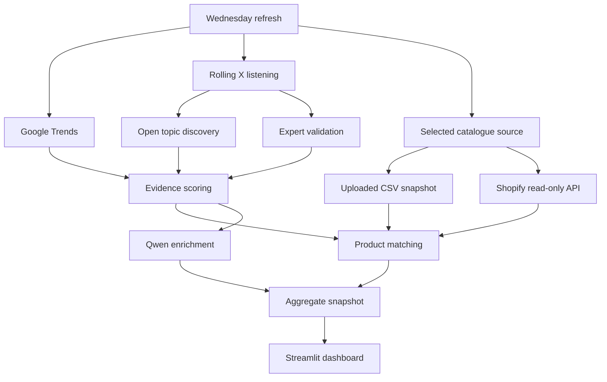

# HULA Trend Intelligence

Current build: **2026.07.22.8**. The build number appears at the bottom of the app sidebar so you can confirm that the global-fashion version is running.

An editorial, data-led Streamlit workflow for deciding which HULA products to feature in weekly marketing. It discovers fashion signals, measures momentum, matches them to the selected HULA catalogue, and turns selected opportunities into campaign briefs.

The interface uses the supplied HULA logo and the `Data Sciences by Teri` lock-up. It opens in a polished demo mode, so the full workflow can be reviewed before any credentials are added.

## What is included

- **This Week** — the highest-confidence external signals and best catalogue opportunities.
- **Trend Radar** — a ranked 0–100 decision view: Act now, Test this week or Watch.
- **Product Match** — transparent product rankings with adjustable weights.
- **Campaign Studio** — Qwen-powered Reel, carousel, email, blog and Soho activation briefs.
- **Data & Setup** — choose a Shopify product CSV or the live Shopify API, test connections, refresh and inspect methodology.
- **Safe diagnostics** — separates expected CSV hybrid mode from real failures, retains connection-test results, and exports a redacted report without credentials.
- **Lightweight Google Trends** — SerpApi replaces the memory-heavy Google Actor and unreliable direct webpage request; the full Google plan is capped at five API searches.
- **Apify X memory recovery** — inspects and stops active HULA X runs, applies hard Actor timeouts and prevents one capacity error from being repeated across the whole search plan.
- **Google cache** — reuses a live 24-hour snapshot on repeated refreshes and retains recent live evidence during a temporary provider outage.
- **Rolling X listening** — five open topic families and a configurable expert panel, each measured in separate current and previous seven-day windows.
- **Noise controls** — cross-query deduplication, privacy-safe author breadth, engagement per view, promotional-content checks and dominant-author penalties.
- **Semantic topic grouping** — Qwen groups aggregated aliases such as `ballet pumps` and `ballet flats`; a local fashion ontology and lexical method remain available if Qwen fails.
- **Fashion-only guardrail** — unrelated social and search topics are removed before scoring, matching or display.
- **Wednesday automation** — a GitHub Action scheduled for 09:17 Hong Kong time.
- **Privacy by design** — raw X posts and identities are not saved; Shopify access is read-only.



## Quick start

```bash
python3 -m venv .venv
source .venv/bin/activate
python -m pip install -r requirements.txt
cp .env.example .env
streamlit run app.py
```

If an older copy is already running, stop it with `Control + C` before starting this folder. Seeing **Build 2026.07.22.8** at the bottom of the sidebar confirms that Terminal opened the updated build.

## Hybrid mode and error reporting

Using an uploaded Shopify CSV intentionally keeps the dataset in **Hybrid Mode**, even when Google Trends, Apify and OpenRouter are connected. This is a provenance label—not an error. Open **Data & Setup → Diagnostics** to compare settings loaded now with the result of the last refresh. Use **Test OpenRouter** to get a specific 400/401/402/403/404/429, timeout or response-format explanation. Campaign Studio keeps a deterministic fallback brief and retains the reason on-screen if Qwen cannot answer.

Without `.env` values, the dashboard uses clearly labelled illustrative data. Add secrets only in `.env` locally or the Streamlit/GitHub secrets interfaces.

## Setup order

1. Choose a product source: follow [CSV catalogue setup](docs/CSV_CATALOGUE.md) for immediate use, or [Shopify setup](docs/SHOPIFY_SETUP.md) for the live read-only API.
2. Follow [Apify setup](docs/APIFY_SETUP.md) to create a ScrapeBadger Advanced Search Task. The app supplies the rolling topic and date-window queries automatically.
3. Add a free SerpApi key using [Google Trends setup](docs/GOOGLE_TRENDS_SETUP.md).
4. Add the OpenRouter settings from `.env.example`. The supplied model slug is already the default.
5. Follow [deployment](docs/DEPLOYMENT.md) for a private GitHub repository, Streamlit and the Wednesday schedule.
6. Read [methodology](docs/METHODOLOGY.md) before using scores in campaign decisions.

## Your OpenRouter settings

Use the same key format you already have, but change the app metadata from NeuroVision to this HULA app:

```env
OPENROUTER_API_KEY=sk-...
OPENROUTER_API_URL=https://openrouter.ai/api/v1/chat/completions
OPENROUTER_MODEL=qwen/qwen3-vl-32b-instruct
OPENROUTER_TIMEOUT=180
OPENROUTER_SITE_URL=https://your-hula-app.streamlit.app/
OPENROUTER_APP_NAME=HULA Trend Intelligence
```

Never commit the key. Qwen receives aggregated trend evidence and selected product metadata only—not Shopify credentials, customers, orders or raw X posts.

## Product catalogue: CSV or API

Open **Data & Setup → Product catalogue** and choose either route:

- **Upload CSV** accepts Shopify's native product export and a simpler one-product-per-row format. Shopify variant rows are collapsed into products, inventory is summed, and the lowest variant price is retained. Review the preview, then select **Use this CSV catalogue**.
- **Shopify API** reads the newest active catalogue on every refresh after the HULA-owned read-only app is connected.

The selected route is saved in the aggregate snapshot. A Wednesday refresh continues using the last uploaded, normalised CSV until a teammate uploads a replacement or successfully switches to the API. The separate Google Trends CSV fallback remains available lower on the same page.

## Scoring at a glance

The external trend score uses the evidence that is actually available:

```text
45% Google Trends worldwide
30% open X topic momentum
15% expert-fashion confirmation
10% TikTok/Pinterest visual validation (reserved until connected)
```

Unavailable sources are excluded and the remaining weights are renormalised; they are not treated as zero. Open X momentum rewards independent-author breadth and growth, engagement per view, topic-family breadth and novelty. It is reduced when duplicates, promotional posts or one dominant author weaken the sample.

The default product opportunity score is 45% external trend strength, 35% catalogue relevance, 15% content readiness and 5% product freshness. The interface lets the team adjust those weights. The numerical ranking remains deterministic; Qwen enriches labels and creative output but cannot rewrite the score.

## Google Trends note

Google's official Trends API is still restricted. This build instead uses SerpApi's Google Trends endpoint. SerpApi performs the Google-facing request and returns structured JSON, so Google Trends consumes no Apify Actor memory and the Streamlit server never needs the fragile `trends.google.com` cookie bootstrap.

Worldwide is the default market. The connector omits `geo` for worldwide requests rather than sending an invalid country label. A full live refresh uses three multi-term comparisons for up to 12 primary terms plus two related-query searches: at most five SerpApi searches. The connection test uses one search.

A successful Google result is cached for 24 hours, so clicking refresh repeatedly does not create another API search. If a later call fails, a compatible saved result up to seven days old can be retained and labelled as cached instead of replacing the radar with demo values. Every refresh records the market, provider, cache age, timeline count and API-search count without storing the key. A manual Trends CSV importer remains available as an operational fallback.

An Apify 402 memory error now concerns X collection only. Open **Data & Setup → Apify X run capacity** to inspect or stop the configured HULA X task.

## Trend label quality

Category-only, vague and unrelated labels are removed before scoring, display, product matching or AI enrichment. The app stores a complete audit for each refresh under **Data & Setup → Trend quality filter**. `bags`, `Interior Design` and `Kindness` are removed; `Mary Janes`, `raffia bags` and `east–west bags` remain valid.

## Test

```bash
pytest -q
```

All tests are offline and use synthetic evidence. No API key is required.
