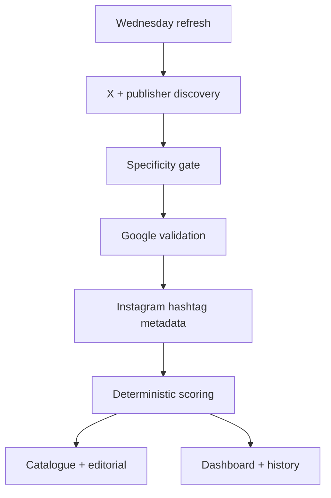

# HULA Trend Intelligence

Current build: **2026.08.04.1**.

A Streamlit workflow for finding fresh fashion signals, validating them across
search and conversation, matching them to HULA's selected catalogue, and
turning the best opportunities into store and editorial actions.

## What is included

- **This Week** — the strongest complete signals and best catalogue matches.
- **Trend Radar** — a complete linked publisher inventory followed by the
  separately validated Act now, Test this week and Watch decisions.
- **Product Match** — transparent product rankings with adjustable weights.
- **Campaign Studio** — Qwen-powered Reel, carousel, email and store briefs.
- **Wednesday Blog** — a 700–1,000-word Gemini draft with Google Search
  grounding, editable Markdown and exact-product claim controls.
- **Data & Setup** — source health, connection tests, refresh diagnostics and a
  complete term-filter audit.

The signal stack is:

```text
35% Google Trends worldwide
20% open X topic momentum
35% approved website/report confirmation
10% aggregate Instagram hashtag comparison
```

A component that was not collected is never converted to zero. A trend enters
the decision list only when fresh Google demand and at least one open,
commercial-report or hashtag source agree.

## Freshness and quality guarantees

- X posts require real timestamps inside the latest fourteen days. The
  timestamp—not a scraper label—determines the current or previous seven-day
  window.
- Missing, malformed, future, reposted, duplicated and older records are
  rejected before candidate extraction.
- Google uses rising-query discovery over `now 7-d`, one-month validation over
  `today 1-m`, and a separate seven-day acceleration series.
- Charts use Google's original 0–100 index. Anchor-calibrated values remain
  internal for cross-query ranking and may never be drawn.
- Low-resolution, plateau-heavy, out-of-range and isolated-spike Google
  timelines are withheld from charts.
- A 24-hour Google cache is live. A compatible cache up to three days old may
  be shown as **STALE**, but it cannot create a recommendation.
- `pants`, `skirt`, `flats` and `polka` are blocked alone. `capri pants`,
  `pencil skirt`, `ballet flats` and `polka dots` remain valid. The approved
  standalone exceptions are `jeans`, `loafers` and `sandals`.

## Commercial websites and reports

The commercial component collects public evidence from:

- Data But Make It Fashion
- Tagwalk
- Trendalytics
- Heuritech
- Who What Wear
- Who What Wear UK
- Vogue
- ELLE
- Lyst

The collector uses publisher pages, RSS feeds and sitemaps, then the existing
SerpApi key as a domain-restricted fallback when a page is blocked or rendered
only with JavaScript. An article/report title, an editorial trend heading,
Tagwalk taxonomy, a Lyst ranked product or an explicitly quantified
data-publisher statement can introduce a trend; ordinary unlabelled prose does
not. Every evidence row keeps its publisher, exact label, article title,
publication date, public URL and acquisition route. Each publisher fails
independently.

## Instagram comparison

Instagram is not a discovery or visual-scraping source. After Google and the
publisher panel qualify a trend, the app requests only aggregate hashtag
metadata: total public uses, posts per day and related hashtag counts. The
Actor input explicitly disables top/latest post collection, so captions,
accounts and images never enter the pipeline. The signal is directional and
is never described as causal.

## Wednesday blog

Gemini runs only after the deterministic ranking and product match are
complete. The draft includes source URLs and evidence statuses. A named person
may be described as wearing a selected product only when a credible source
supports the exact design. A similar item is labelled `similar_design_only`
and excluded from factual publishable copy.

Soho and The Hub are available equally as campaign objectives, store
activations, editorial reasons and calls to action.

## Architecture



## Quick start

```bash
python3 -m venv .venv
source .venv/bin/activate
python -m pip install -r requirements.txt
cp .env.example .env
python -m streamlit run app.py
```

Seeing **Build 2026.08.04.1** at the bottom of the sidebar confirms that the
correct version is running.

## Setup order

1. Choose a catalogue route: [CSV](docs/CSV_CATALOGUE.md) or
   [Shopify API](docs/SHOPIFY_SETUP.md).
2. Configure [X via Apify](docs/APIFY_SETUP.md).
3. Review the [commercial website panel](docs/COMMERCIAL_SOURCES.md).
4. Configure [aggregate Instagram hashtags](docs/INSTAGRAM_SETUP.md).
5. Configure [Google Trends through SerpApi](docs/GOOGLE_TRENDS_SETUP.md).
6. Run the [Supabase schema](docs/SUPABASE_SETUP.md).
7. Configure the [Gemini Wednesday blog](docs/GEMINI_BLOG_SETUP.md).
8. Add the OpenRouter/Qwen settings from `.env.example`.
9. Follow the [deployment guide](docs/DEPLOYMENT.md).
10. Review the [methodology](docs/METHODOLOGY.md).

Streamlit Secrets and GitHub Actions Secrets are separate. Add each credential
to both stores if the dashboard and scheduled Wednesday workflow both need it.
Never commit `.env`, `.streamlit/secrets.toml`, API keys or raw catalogue files.

## Test

```bash
pytest -q
```

The 85 tests are offline and require no real API credentials.
