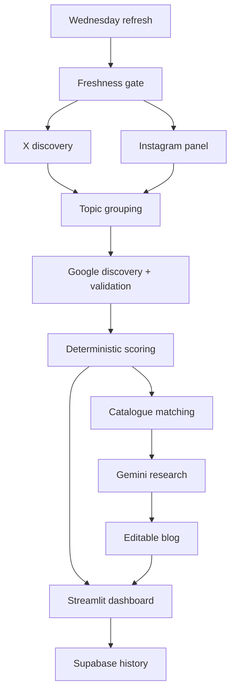

# HULA Trend Intelligence

Current build: **2026.07.28.1**.

A Streamlit workflow for finding fresh fashion signals, validating them across
search and conversation, matching them to HULA's selected catalogue, and
turning the best opportunities into store and editorial actions.

## What is included

- **This Week** — the strongest complete signals and best catalogue matches.
- **Trend Radar** — Act now, Test this week or Watch, with incomplete rows
  separated from the decision list.
- **Product Match** — transparent product rankings with adjustable weights.
- **Campaign Studio** — Qwen-powered Reel, carousel, email and store briefs.
- **Wednesday Blog** — a 700–1,000-word Gemini draft with Google Search
  grounding, editable Markdown and exact-product claim controls.
- **Data & Setup** — source health, connection tests, refresh diagnostics and a
  complete term-filter audit.

The signal stack is:

```text
35% Google Trends worldwide
20% open X topic momentum
35% approved commercial-source confirmation
10% approved Instagram visual validation
```

A component that was not collected is never converted to zero. A trend enters
the decision list only when fresh Google demand and at least one open,
commercial or visual source agree.

## Freshness and quality guarantees

- X and Instagram posts require real timestamps inside the latest fourteen
  days. The timestamp—not a scraper label—determines the current or previous
  seven-day window.
- Missing, malformed, future, reposted, duplicated and older records are
  rejected before candidate extraction.
- Google uses rising-query discovery over `now 7-d`, one-month validation over
  `today 1-m`, and a separate seven-day acceleration series.
- Invariant and malformed Google timelines are excluded from scoring and
  charts; the app never draws a fabricated-looking flat line.
- A 24-hour Google cache is live. A compatible cache up to three days old may
  be shown as **STALE**, but it cannot create a recommendation.
- `sandal` and `sandals` are valid. `trousers`, `outfit ideas`, `dress` and
  `mini` are blocked when they are the complete trend name; `red trousers`,
  `mini dress`, `designer bags` and `east–west bags` remain valid.

## Approved Instagram panel

Priority, 3× evidence weight:

- Data But Make It Fashion
- Tagwalk
- Who What Wear
- Who What Wear UK
- Lyst

Specialist, 2× evidence weight:

- Vogue Runway
- WGSN
- Trendalytics
- EDITED
- Heuritech

The panel uses Apify's maintained Instagram Post Scraper. Public post images
are sent to Qwen only for the capped visual-reading pass. Raw X and Instagram
records are not stored in the aggregate snapshot.

## Wednesday blog

Gemini runs only after the deterministic ranking and product match are
complete. The draft includes source URLs and evidence statuses. A named person
may be described as wearing a selected product only when a credible source
supports the exact design. A similar item is labelled `similar_design_only`
and excluded from factual publishable copy.

Soho and The Hub are available equally as campaign objectives, store
activations, editorial reasons and calls to action.

## Architecture



## Quick start

```bash
python3 -m venv .venv
source .venv/bin/activate
python -m pip install -r requirements.txt
cp .env.example .env
python -m streamlit run app.py
```

Seeing **Build 2026.07.28.1** at the bottom of the sidebar confirms that the
correct version is running.

## Setup order

1. Choose a catalogue route: [CSV](docs/CSV_CATALOGUE.md) or
   [Shopify API](docs/SHOPIFY_SETUP.md).
2. Configure [X via Apify](docs/APIFY_SETUP.md).
3. Configure the [approved Instagram panel](docs/INSTAGRAM_SETUP.md).
4. Configure [Google Trends through SerpApi](docs/GOOGLE_TRENDS_SETUP.md).
5. Run the [Supabase schema](docs/SUPABASE_SETUP.md).
6. Configure the [Gemini Wednesday blog](docs/GEMINI_BLOG_SETUP.md).
7. Add the OpenRouter/Qwen settings from `.env.example`.
8. Follow the [deployment guide](docs/DEPLOYMENT.md).
9. Review the [methodology](docs/METHODOLOGY.md).

Streamlit Secrets and GitHub Actions Secrets are separate. Add each credential
to both stores if the dashboard and scheduled Wednesday workflow both need it.
Never commit `.env`, `.streamlit/secrets.toml`, API keys or raw catalogue files.

## Test

```bash
pytest -q
```

The 66 tests are offline and require no real API credentials.
