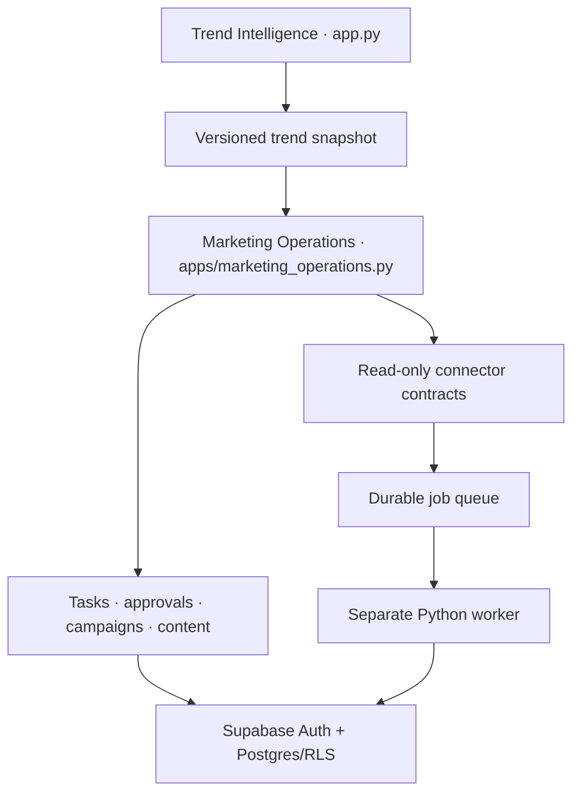

# Architecture decision: HULA Marketing Operations

**Decision date:** 6 August 2026  
**Status:** Accepted for the first release

## Decision

Keep HULA Trend Intelligence and HULA Marketing Operations in the same
repository, but deploy them as independent Streamlit entry points:

- `app.py` — existing Trend Intelligence compatibility entry point.
- `apps/marketing_operations.py` — new Marketing Operations entry point.

The new app may read the versioned trend snapshot, but it does not import or
execute the Trend Intelligence UI. A Marketing Operations page failure is
caught at its own boundary and cannot prevent `app.py` from loading.

## Runtime topology



Streamlit is the internal control plane for navigation, dashboards, filters,
forms, review, approvals, job submission and downloads. It is not the execution
environment for crawls, backfills or large API synchronisations.

## Data modes

Every source/run/record must declare one of:

- `demo` — illustrative application behavior;
- `fixture` — a fixed validation/report-parity dataset;
- `live` — authenticated provider data from a successful sync;
- `partial` — authenticated but incomplete data.

Demo or fixture work cannot be promoted to Approved, Scheduled or Implemented
as live operational work. The bundled July 2026 report-parity dataset is
labelled `fixture` on every page and export.

## Source separation

The system keeps these layers distinct:

1. Provider/source snapshots and sync metadata.
2. Normalized facts and dimensions.
3. Governed metrics and reconciliation.
4. Deterministic signals.
5. Human tasks and decisions.
6. Proposed external actions.
7. Provider execution receipts and outcome measurement.

The first release implements layers 3–5 with fixtures, the connector contract,
three read clients, and the operational foundation. It contains no external
action adapter.

## Identity and authorization

Demo mode takes its access level from `DEMO_DEFAULT_ROLE`; there is no role
switcher in the application. Production mode uses Supabase Auth and a
RLS-protected `marketing_members` record. Permissions are enforced in the
Python service and again by Postgres policies.

Access levels:

- **Viewer** — one read-only overview for leadership and sales;
- **Administrator** — the sole operational user with full workspace access.

Marketing, paid-media, merchandising, data and review responsibilities remain
workflow ownership labels. They do not create additional application roles or
navigation variants.

High-risk requests cannot be second-approved by their requester. Audit records
have no update/delete policy.

## Storage

`src/marketing_ops/store.py` provides a SQLite operational fallback so the full
workflow can run offline and in CI. It is clearly a demo/local store. Production
uses `database/migrations/001_marketing_operations.sql` followed by
`002_two_role_access.sql`, Supabase Auth, RLS and worker-only privileged
credentials.

The existing weekly trend JSON remains a trend cache and is not promoted into
the Marketing Operations system of record.

## Connector boundary

All connectors implement:

```python
validate_config()
test_connection()
sync(window)
capabilities()
```

Shopify orders/refunds, GA4 and Search Console have read-only HTTP
implementations. Google Ads, Meta, Klaviyo, Google Business Profile, Merchant
Center and PageSpeed are honest configuration/health shells. A shell never
returns a fake successful connection or fabricated source rows.

Pinned at build time:

| Provider | Version |
|---|---|
| Shopify Admin GraphQL | `2026-07` |
| GA4 Data API | v1 (`v1beta` REST resource path used by runReport) |
| Search Console | v1 / webmasters v3 REST endpoint |
| Google Ads | v25 shell |
| Meta Marketing API | v26.0 shell |
| Klaviyo | `2026-01-15` stable shell |
| Merchant API | v1 shell |
| PageSpeed Insights | v5 shell |

Versions must be rechecked against official documentation before each release.

## Rejected alternatives

- **Replace `app.py`:** rejected because the 94-test trend baseline is working
  and valuable.
- **One giant Streamlit app:** rejected because a marketing failure would risk
  the trend workflow and increase coupling.
- **Unrelated repository:** rejected because shared fashion intelligence,
  configuration and deployment conventions are reusable.
- **Synchronous live integration buttons:** rejected because retries, timeouts
  and duplicate paid requests require durable jobs.
- **Automatic writes in release one:** rejected because approval, diff,
  idempotency, verification and rollback adapters are not yet proven.
